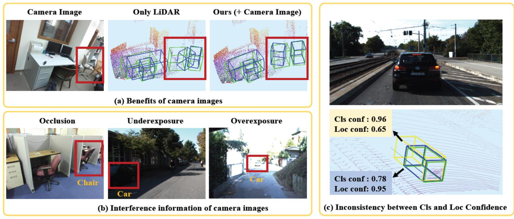
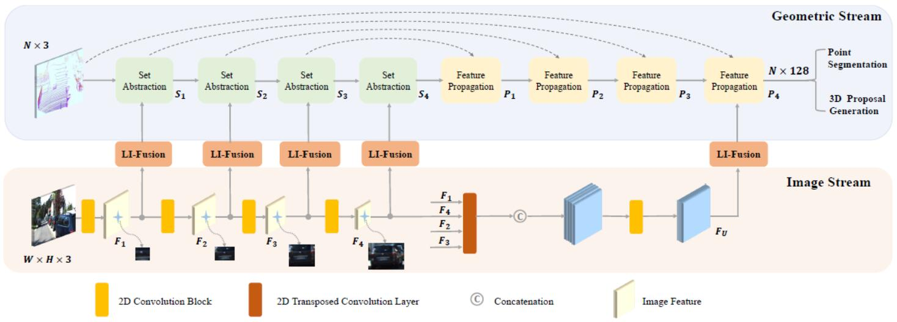

# EPNet
EPNet: Enhancing Point Features with Image Semantics for 3D Object Detection (ECCV 2020).
Paper is now available in [EPNet](https://arxiv.org/pdf/2007.08856.pdf), and the code is based on [PointRCNN](https://github.com/sshaoshuai/PointRCNN).

## Highlights
0. Without extra image annotations, e.g. 2D bounding box, Semantic labels and so on. 
2. A more accurate multi-scale point-wise fusion for Image and Point Cloud. 
3. The proposed CE loss can improve the performance of 3D Detection greatly.
3. Without GT AUG.

## Contributions
This is Pytorch implementation for EPNet on KITTI dataset, which  is mainly achieved by  [Liu Zhe](https://github.com/happinesslz) and [Huang Tengteng](https://github.com/tengteng95). Some parts also benefit from [Chen Xiwu](https://github.com/XiwuChen).

## Abstract
In this paper, we aim at addressing two critical issues in the 3D detection task, including the exploitation of multiple sensors~(namely LiDAR point cloud and camera image), as well as the inconsistency between the localization and classification confidence. To this end, we propose a novel fusion module to enhance the point features with semantic image features in a point-wise manner without any image annotations. Besides, a consistency enforcing loss is employed to explicitly encourage the consistency of both the localization and classification confidence. We design an end-to-end learnable framework named EPNet to integrate these two components. Extensive experiments on the KITTI and SUN-RGBD datasets demonstrate the superiority of EPNet over the state-of-the-art methods. 



## Network
The architecture of our two-stream RPN is shown in the below.



The architecture of our LI-Fusion module in the two-stream RPN.


## Install(Same with [PointRCNN](https://github.com/sshaoshuai/PointRCNN))

The Environment：
* Linux (tested on Ubuntu 16.04)
* Python 3.6+
* PyTorch 1.0+

a. Clone the PointRCNN repository.
```shell
git clone https://github.com/happinesslz/EPNet.git
```

b. Install the dependent python libraries like `easydict`,`tqdm`, `tensorboardX ` etc.

c. Build and install the `pointnet2_lib`, `iou3d`, `roipool3d` libraries by executing the following command:
```shell
sh build_and_install.sh
```

## Dataset preparation
Please download the official [KITTI 3D object detection](http://www.cvlibs.net/datasets/kitti/eval_object.php?obj_benchmark=3d) dataset and organize the downloaded files as follows: 
```
EPNet
├── data
│   ├── KITTI
│   │   ├── ImageSets
│   │   ├── object
│   │   │   ├──training
│   │   │      ├──calib & velodyne & label_2 & image_2 & (optional: planes)
│   │   │   ├──testing
│   │   │      ├──calib & velodyne & image_2
├── lib
├── pointnet2_lib
├── tools
```


## Trained model
The results of Car on Recall 40:

|LI Fusion| CE loss|   Easy | Moderate |   Hard |  mAP  |models|
|  ----  | ----   |  ----  |   ----  |   ----  |  ---- |---- |
|    No  |  No    |  88.76 |  78.03  |   76.20 |  80.99| [Google](https://drive.google.com/drive/folders/1MT-gArGnu-4qrThjHtEKjWZ_8999nwWx?usp=sharing), [Baidu](https://pan.baidu.com/s/1ZBr9oFzOi2OZCutjYkpM6Q) (a43t)|
|    Yes |  No    |  89.93 |  80.77  |   77.25 |  82.65| [Google](https://drive.google.com/drive/folders/1mvmZY-XXmt059IODlJgKXtuFH0Wmp3MT?usp=sharing), [Baidu](https://pan.baidu.com/s/1MgTynfR2MfVspV8HMyzgGw) (dbxy)|
|    No  |  Yes   |  92.12 |  81.48  |   79.34 |  84.31| [Google](https://drive.google.com/drive/folders/1Up2siHcBOIIGrHKok7nVu9YoBPQS9rcR?usp=sharing), [Baidu](https://pan.baidu.com/s/19-CVgQT_lQ6iyb-PVZ0sDQ) (hrkv)|
|    Yes | Yes    |  92.17 |  82.68  |   80.10 |  84.99| [Google](https://drive.google.com/drive/folders/1tON7-ooxcEMeB7wEfH914SRPlai7npU9?usp=sharing), [Baidu](https://pan.baidu.com/s/1rMnodG0a5uuJtCSX-bzr1Q) (nasm)|

For evaluating these models, please download the above  models. Unzip these models  and place them to "./log/Car/models"
```shell
cd ./tools
mkdir -p log/Car/models
bash run_eval_model.sh
```

## Implementation
### Training
Run EPNet for single gpu:
```shell
CUDA_VISIBLE_DEVICES=0 python train_rcnn.py --cfg_file cfgs/LI_Fusion_with_attention_use_ce_loss.yaml --batch_size 2 --train_mode rcnn_online --epochs 50 --ckpt_save_interval 1 --output_dir ./log/Car/full_epnet_without_iou_branch/   --set LI_FUSION.ENABLED True LI_FUSION.ADD_Image_Attention True RCNN.POOL_EXTRA_WIDTH 0.2 RPN.SCORE_THRESH 0.2 RCNN.SCORE_THRESH 0.2  USE_IOU_BRANCH False TRAIN.CE_WEIGHT 5.0
```
Run EPNet for two gpu:
```shell
CUDA_VISIBLE_DEVICES=0,1 python train_rcnn.py --cfg_file cfgs/LI_Fusion_with_attention_use_ce_loss.yaml --batch_size 6 --train_mode rcnn_online --epochs 50 --mgpus --ckpt_save_interval 1 --output_dir ./log/Car/full_epnet_without_iou_branch/   --set LI_FUSION.ENABLED True LI_FUSION.ADD_Image_Attention True RCNN.POOL_EXTRA_WIDTH 0.2 RPN.SCORE_THRESH 0.2 RCNN.SCORE_THRESH 0.2  USE_IOU_BRANCH False TRAIN.CE_WEIGHT 5.0
```
### Testing
```shell
CUDA_VISIBLE_DEVICES=2 python eval_rcnn.py --cfg_file cfgs/LI_Fusion_with_attention_use_ce_loss.yaml --eval_mode rcnn_online  --eval_all  --output_dir ./log/Car/full_epnet_without_iou_branch/eval_results/  --ckpt_dir ./log/Car/full_epnet_without_iou_branch/ckpt --set  LI_FUSION.ENABLED True LI_FUSION.ADD_Image_Attention True RCNN.POOL_EXTRA_WIDTH 0.2  RPN.SCORE_THRESH 0.2 RCNN.SCORE_THRESH 0.2  USE_IOU_BRANCH False
```

## Acknowledgement
The code is based on [PointRCNN](https://github.com/sshaoshuai/PointRCNN). 

## Citation
If you find this work useful in your research, please consider cite:

```
@article{Huang2020EPNetEP,
  title={EPNet: Enhancing Point Features with Image Semantics for 3D Object Detection},
  author={Tengteng Huang and Zhe Liu and Xiwu Chen and Xiang Bai},
  booktitle ={ECCV},
  month = {July},
  year={2020}
}
```
```
@InProceedings{Shi_2019_CVPR,
    author = {Shi, Shaoshuai and Wang, Xiaogang and Li, Hongsheng},
    title = {PointRCNN: 3D Object Proposal Generation and Detection From Point Cloud},
    booktitle = {The IEEE Conference on Computer Vision and Pattern Recognition (CVPR)},
    month = {June},
    year = {2019}
}
```


